<p align="center">
  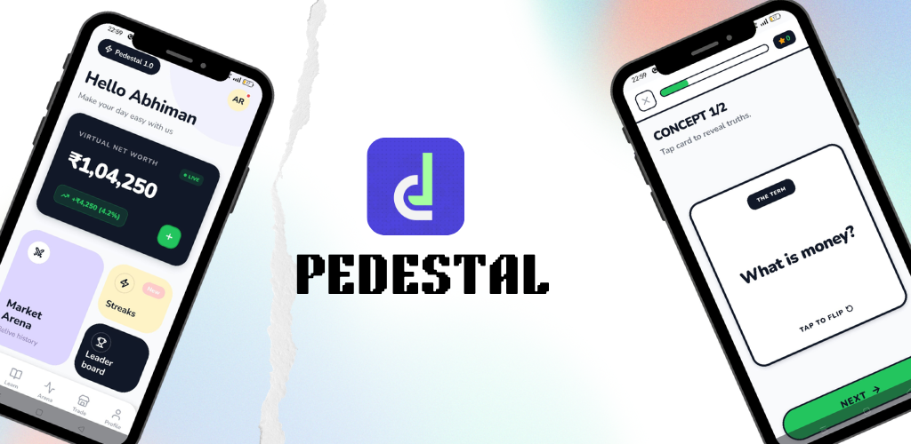
</p>

<h1 align="center">🏛️ Pedestal</h1>

<p align="center">
  <strong>Gen-Z Fintech Micro-Learning Platform — Reinforced Learning Stack</strong><br/>
  Learn investing. Build wealth. Level up — one micro-lesson at a time.
</p>

<p align="center">
  
  
  
  
  
  
</p>

---

## 📋 Table of Contents

- [Overview](#-overview)
- [Problem Statement](#-problem-statement)
- [Key Features](#-key-features)
- [System Architecture](#-system-architecture)
- [Adaptive Learning Engine](#-adaptive-learning-engine)
- [Energy Economy System](#-energy-economy-system)
- [Database Schema](#-database-schema)
- [User Flow & Navigation](#-user-flow--navigation)
- [UI/UX Design Philosophy](#-uiux-design-philosophy)
- [Tech Stack](#-tech-stack)
- [Project Structure](#-project-structure)
- [API Reference](#-api-reference)
- [Getting Started](#-getting-started)
- [Environment Variables](#-environment-variables)
- [Build & Deployment](#-build--deployment)
- [Contributing](#-contributing)
- [License](#-license)

---

## 🌟 Overview

**Pedestal** is a gamified, adaptive micro-learning platform that makes financial education engaging, interactive, and personalized for Gen-Z learners. Built on a proprietary **Reinforced Learning Stack (RLS)**, Pedestal dynamically adjusts learning paths based on real-time performance — combining concept flip cards, virtual paper trading, adaptive quizzes, an energy economy, streaks, and global leaderboards into a cohesive learning experience.

The platform bridges the gap between "wanting to learn about money" and "actually understanding investing" by turning complex financial concepts into bite-sized, swipeable, gamified micro-lessons that feel like a game, not a textbook.

### 🎯 Core Vision
> *"Financial literacy shouldn't require a finance degree. It should feel as natural as scrolling through your feed."*

Pedestal distills complex financial topics — stocks, crypto, budgeting, risk management — into 60-second micro-lessons with immediate reinforcement through quizzes and flashcards, all driven by an AI-powered adaptive engine that meets each learner exactly where they are.

---

## 🔥 Problem Statement

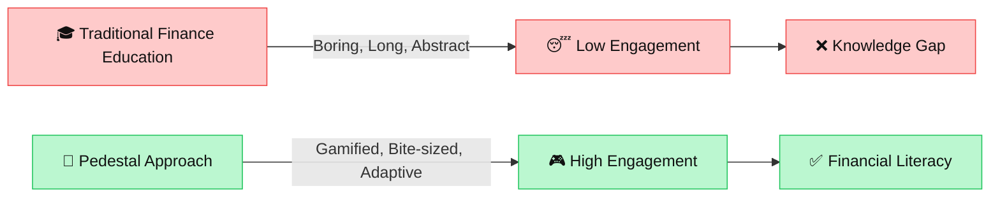

| Traditional Approach | Pedestal Approach |
|---|---|
| 45-minute lectures | 60-second micro-lessons |
| Static PDFs | Interactive flip cards & videos |
| One-size-fits-all | AI-adaptive difficulty scaling |
| No feedback loop | Real-time quizzes + reinforcement queue |
| Theory only | Virtual paper trading with ₹1,00,000 |
| Isolated learning | Global leaderboards & streaks |

---

## ✨ Key Features

### 🎴 Concept Flip Cards
Swipeable, interactive cards that teach one financial concept at a time. Tap to flip — "The Term" on the front, the explanation on the back. Designed for micro-moment learning during commutes, breaks, or downtime.

### 📊 Virtual Paper Trading
Every user starts with a virtual ₹1,00,000 portfolio. Buy, sell, and short-sell stocks in a risk-free simulation powered by real-time market data. Track your P&L, view holdings, and learn from your trading history.

### 🤖 Adaptive Learning Engine
An AI-powered engine that evaluates quiz performance and dynamically adjusts:
- **Difficulty level** (1–10 scale)
- **Adaptive scores** across 4 dimensions (Risk, Discipline, Knowledge, Stability)
- **Reinforcement queue** (remedial lessons + flashcard reviews)
- **Next lesson path** based on mastery

### ⚡ Energy Economy (Lightning Bolts)
A balanced energy system that paces learning to prevent burnout while encouraging daily returns:
- 100 max energy with time-based regeneration
- Lessons cost energy to start
- Energy regenerates at 5 points every 30 minutes

### 🏆 Leaderboards & Streaks
Compete globally. Maintain daily streaks. Earn XP to level up. The gamification layer keeps users coming back.

### 🗺️ Learning Roadmap
A visual, Duolingo-inspired skill tree with branching learning paths. Nodes unlock sequentially, showing locked, current, and completed states.

### 📝 Adaptive Quizzes
Context-aware quizzes that evaluate understanding after each lesson. Performance directly feeds into the adaptive engine to customize future content.

### 🔔 Push Notifications
Firebase Cloud Messaging (FCM) delivers streak reminders, achievement unlocks, and lesson recommendations directly to the device.

---

## 🏛️ System Architecture

### High-Level Architecture

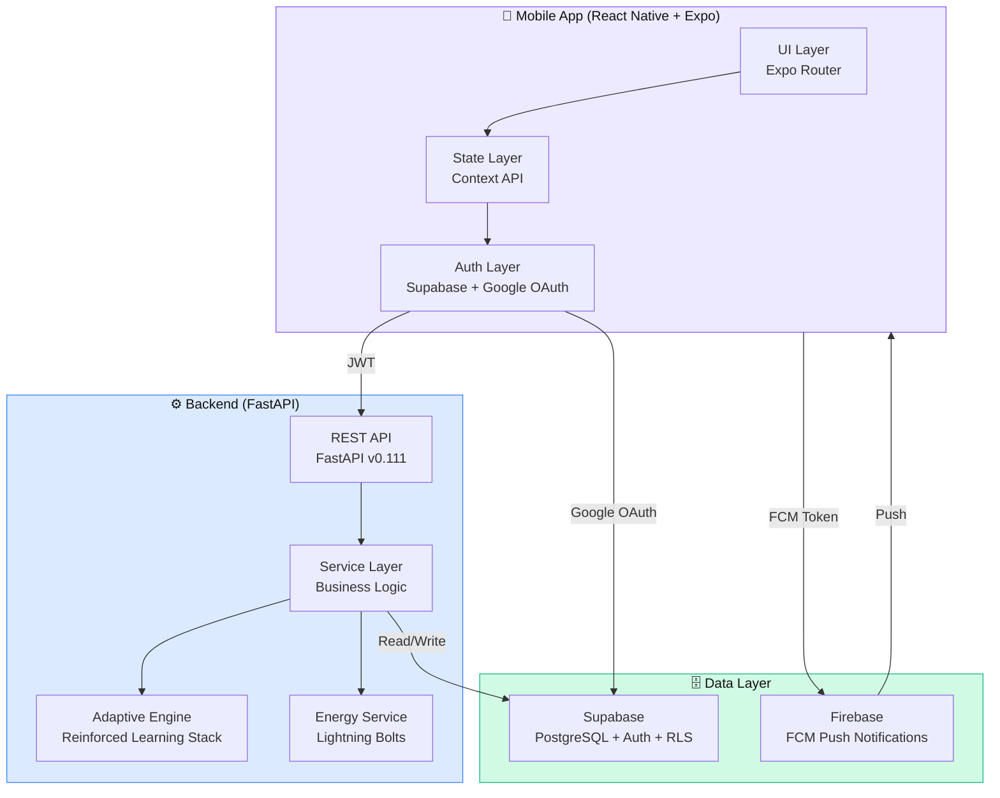

### Request Lifecycle

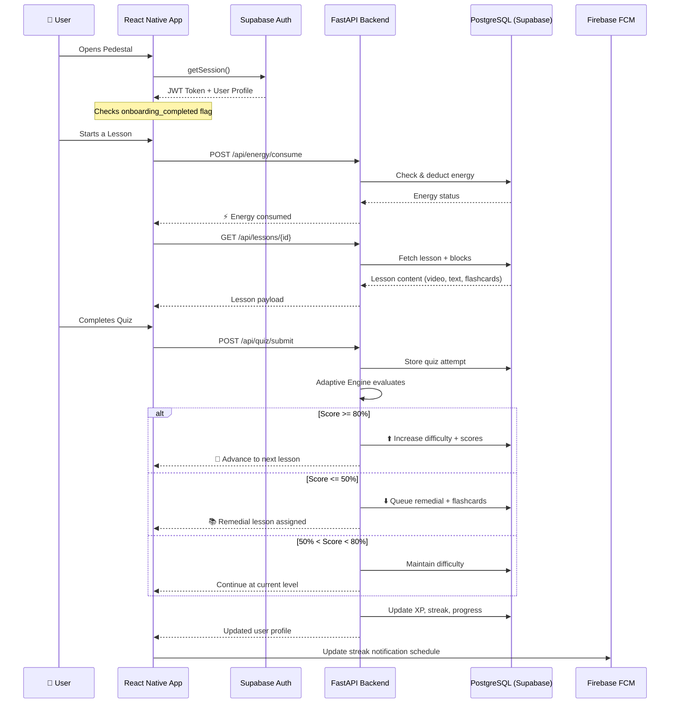

---

## 🧠 Adaptive Learning Engine

The heart of Pedestal is the **Reinforced Learning Stack (RLS)** — an adaptive engine that personalizes each learner's path in real-time.

### How It Works

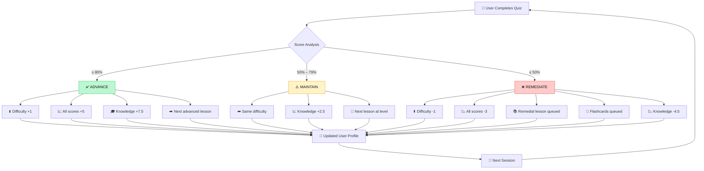

### Adaptive Score Dimensions

Each user has 4 continuously-updating adaptive scores (0–100):

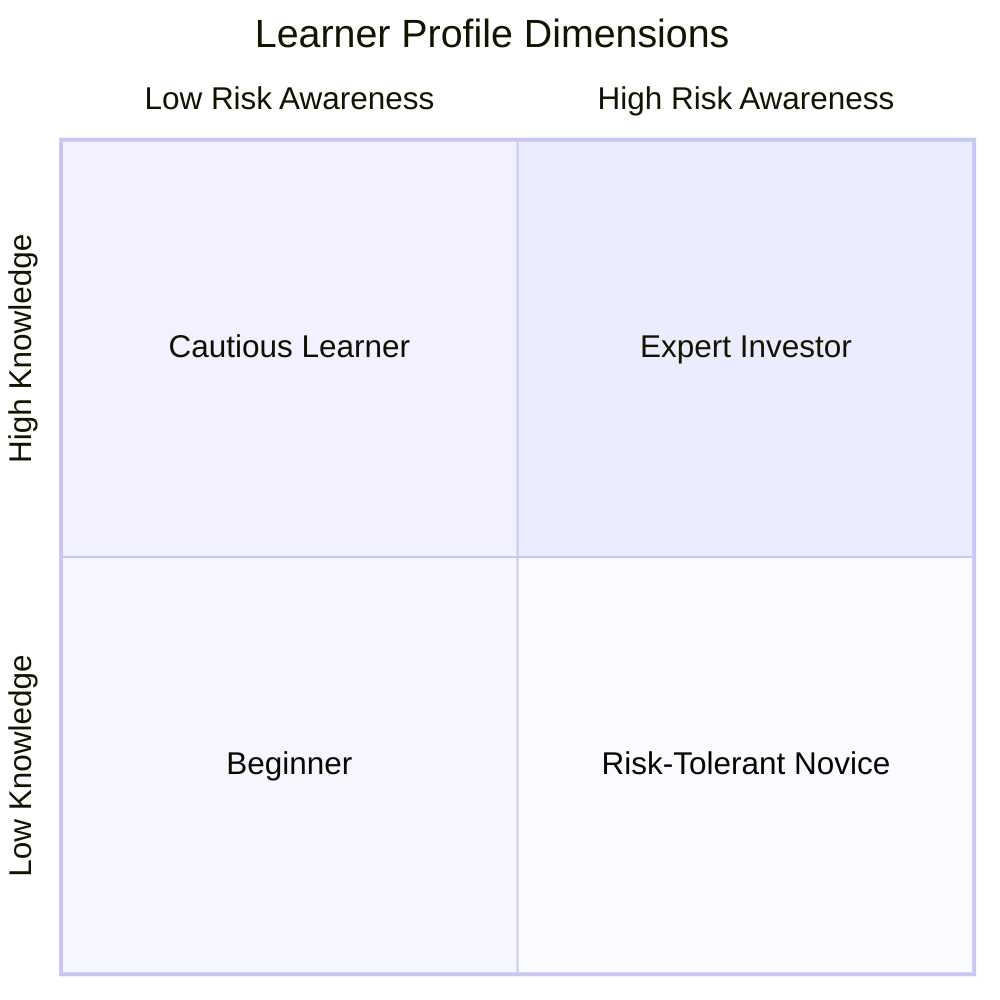

| Score | What It Measures | Affects |
|---|---|---|
| 🎯 **Risk Score** | Understanding of risk/reward concepts | Portfolio lesson difficulty |
| 📏 **Discipline Score** | Consistency and habit formation | Streak bonus multipliers |
| 📚 **Knowledge Score** | Overall financial literacy | Lesson content difficulty |
| ⚖️ **Stability Score** | Emotional decision-making patterns | Trading simulation complexity |

### Reinforcement Queue Priority System

```
Remedial Lessons   → Priority 10 (highest)
Flashcard Reviews  → Priority  5 (medium)
Spaced Repetition  → Priority  3 (lowest)
```

The engine always checks the reinforcement queue before recommending a new lesson. Unfinished remedial content takes absolute priority.

---

## ⚡ Energy Economy System

The **Lightning Bolts** energy system balances engagement with healthy learning pacing.

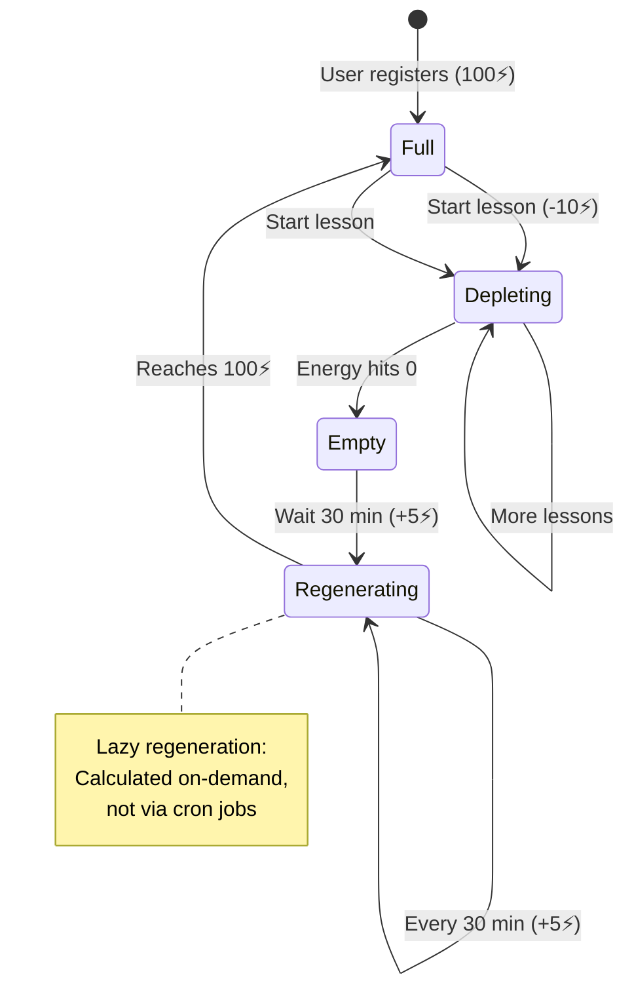

| Parameter | Value | Purpose |
|---|---|---|
| Max Energy | 100 ⚡ | Allows ~10 lessons per cycle |
| Lesson Cost | 10 ⚡ | Balanced pacing |
| Regen Rate | 5 ⚡ / interval | Gradual recovery |
| Regen Interval | 30 minutes | Encourages daily return |
| Time to Full | ~10 hours | Prevents all-day binging |
| Minimum to Start | 1 ⚡ | Must have some energy |

> **Design Decision:** Energy is calculated **lazily** on each API request — no background cron jobs. The backend computes elapsed time since `last_updated`, calculates regenerated energy, and persists the result. This is infinitely scalable and eliminates timer infrastructure.

---

## 🗄️ Database Schema

### Entity Relationship Diagram

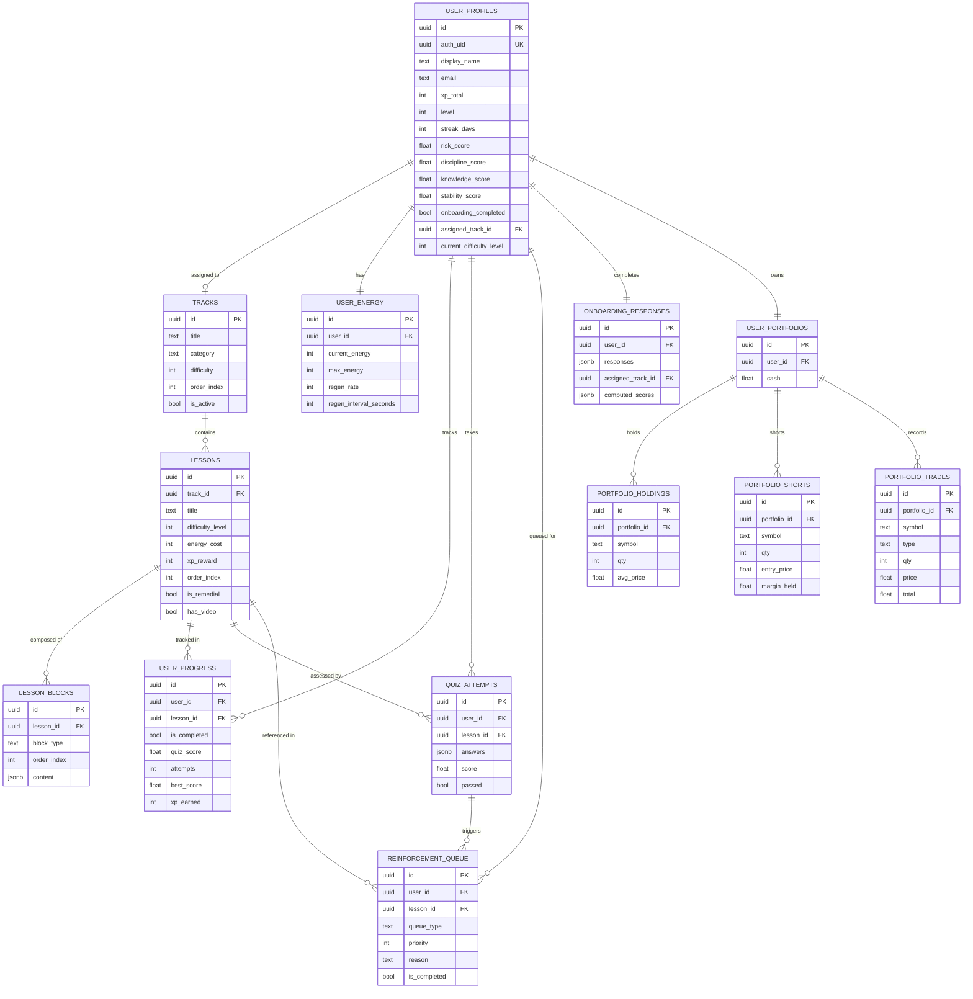

### Content Block System

Lesson content is modular, stored as flexible JSONB blocks:

| Block Type | Content Structure | Purpose |
|---|---|---|
| `video` | `{ url, duration_seconds, thumbnail_url }` | Short video explanations |
| `audio` | `{ url, duration_seconds, transcript }` | Audio-first learning |
| `text` | `{ body, highlights }` | Text explanations with highlights |
| `quiz` | `{ questions: [{ q, options, correct }] }` | Inline assessment |
| `flashcard` | `{ cards: [{ front, back }] }` | Spaced-repetition cards |
| `live_data` | `{ widget_type, symbol, config }` | Real-time market widgets |

### Row Level Security (RLS)

All user-specific tables enforce RLS policies. Users can **only** read and modify their own data. Tracks and lessons are publicly readable.

---

## 🗺️ User Flow & Navigation

### Complete User Journey

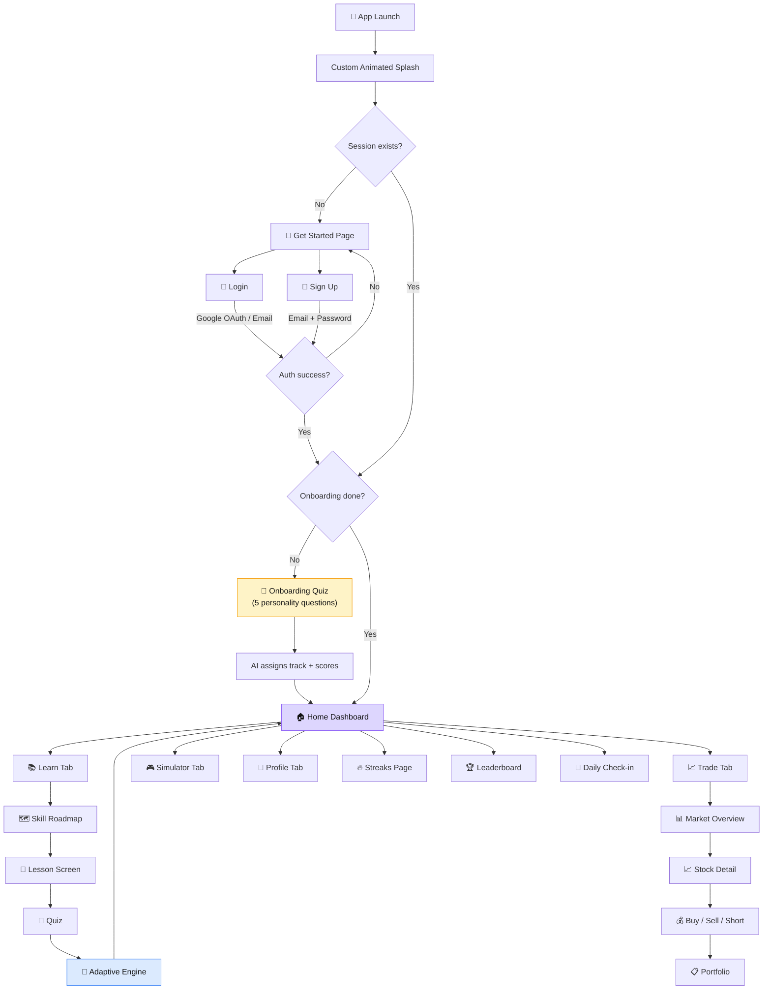

### Tab Navigation Structure

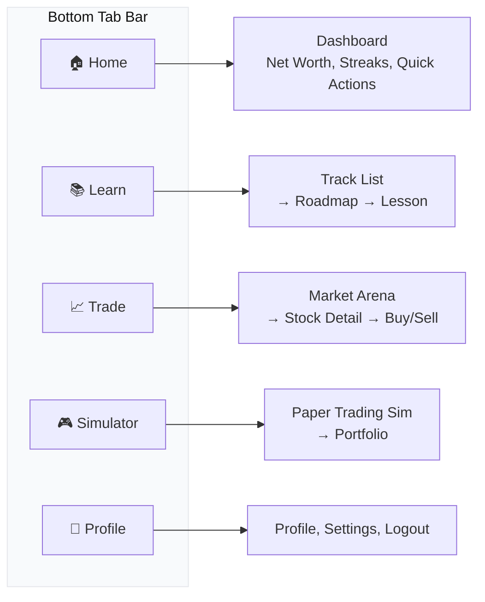

---

## 🎨 UI/UX Design Philosophy

### Design Principles

Pedestal's UI is built on a carefully considered set of design principles that prioritize clarity, engagement, and delight.

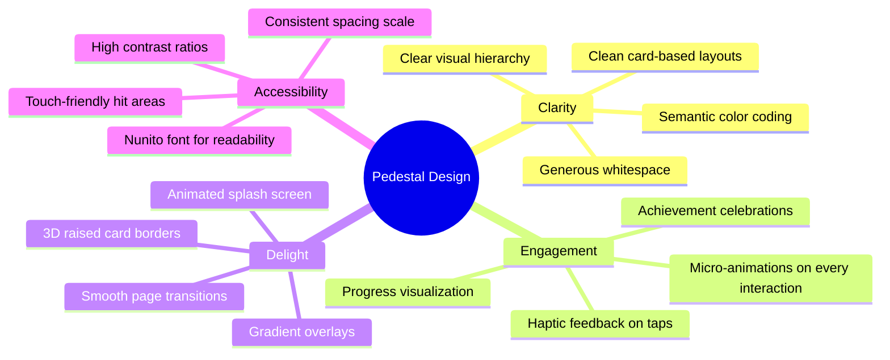

### Design System Tokens

| Category | Token | Value | Intent |
|---|---|---|---|
| **Primary** | `primary` | `#2563EB` | CTAs, active states, navigation |
| **Secondary** | `secondary` | `#111827` | Headers, dark cards, emphasis |
| **Background** | `background` | `#F8FAFC` | Clean, minimal canvas |
| **Success** | `neonGreen` | `#22C55E` | Positive P&L, completion states |
| **Streak** | `streak` | `#F97316` | Fire/streak highlight color |
| **XP** | `xp` | `#FBBF24` | XP badges, reward indicators |
| **Error** | `error` | `#EF4444` | Negative P&L, failure states |
| **Font** | `Nunito` | Regular → Black (400–900) | Friendly, rounded, approachable |
| **Border Radius** | `sm – full` | 12px → 999px | Consistent rounded feel |
| **Spacing** | `xs – huge` | 4px → 48px | 8-point aligned scale |

### Signature UI Patterns

#### 1. 3D Raised Cards
Cards across the app use a distinctive **bottom-border technique** to create a tactile, raised-platform aesthetic:
```css
border-bottom-width: 4px;
border-bottom-color: #1E40AF;  /* navy shadow */
```
This creates a subtle 3D "pedestal" effect — tying the visual language directly to the brand name.

#### 2. Dark Hero Cards
The portfolio/net worth widget at the top of the Home screen uses a **dark card** (`#111827`) with `neonGreen` accents for the P&L, creating a premium, fintech-grade contrast against the light `#F8FAFC` background.

#### 3. Pastel Category Tags
Category chips and tags use soft pastel backgrounds (`#DDD6FE`, `#FEF3C7`, `#BBF7D0`, `#FECACA`) to differentiate content types while maintaining visual harmony.

#### 4. Duolingo-Inspired Skill Roadmap
The learn screen features a **winding path layout** with unlockable nodes that show progression. Completed nodes use `primary` blue, the current node pulses with animation, and locked nodes are greyed out — creating an intuitive sense of journey.

#### 5. Flip Card Interaction
Lesson concept cards use a **tap-to-flip** paradigm. The front shows "The Term" as a prompt; tapping reveals the explanation on the reverse. This leverages active recall — a proven learning technique.

### UI/UX Improvement Ideas

> These are planned enhancements and considerations for future iterations:

| Area | Current | Proposed Enhancement |
|---|---|---|
| **Onboarding** | Linear 5-question survey | Animated, story-driven onboarding with illustrations per question |
| **Lesson Completion** | Simple success toast | Full-screen confetti animation with XP/level-up celebration |
| **Portfolio View** | Flat holdings list | Mini stock charts inline (sparklines) for each holding |
| **Leaderboard** | Static list | Animated rank transitions, "you vs friends" dual view |
| **Streaks** | Calendar grid | Heatmap-style contribution graph (like GitHub) |
| **Empty States** | None / blank | Illustrated empty states with motivational CTAs |
| **Skeleton Loading** | None | Shimmer/skeleton placeholders while content loads |
| **Micro-animations** | Limited | Add spring-based enter/exit anims to every card |
| **Haptics** | Basic tab press | Rich haptic patterns: success, error, milestone |
| **Dark Mode** | Auto system | Manual toggle with smooth theme transition |
| **Sound Effects** | None | Optional subtle sounds for XP gain, level up, streak |
| **Accessibility** | Basic | VoiceOver labels, reduced motion support, font scaling |
| **Gesture Nav** | Tap only | Swipe between lessons, pull-to-refresh on portfolio |
| **Offline Mode** | None | Cache last 5 lessons for offline learning |
| **Notifications** | Basic reminders | Rich notifications with inline lesson preview |

### Color Mood Board

```
┌─────────────────────────────────────────────────────────────┐
│  ██████  Primary     #2563EB   Trust, Technology, Finance   │
│  ██████  Secondary   #111827   Premium, Dark, Authority     │
│  ██████  Background  #F8FAFC   Clean, Open, Minimal         │
│  ██████  Success     #22C55E   Growth, Profit, Achievement  │
│  ██████  Streak      #F97316   Fire, Urgency, Momentum      │
│  ██████  XP/Gold     #FBBF24   Reward, Value, Currency      │
│  ██████  Error       #EF4444   Loss, Warning, Alert         │
│  ██████  Pastel P    #DDD6FE   Calm, Category, Tag          │
│  ██████  Pastel Y    #FEF3C7   Warm, Highlight, Tip         │
│  ██████  Pastel G    #BBF7D0   Growth, Positive, New        │
└─────────────────────────────────────────────────────────────┘
```

---

## 🛠️ Tech Stack

### Frontend — Mobile Application

| Technology | Version | Purpose |
|---|---|---|
| [React Native](https://reactnative.dev/) | `0.81.5` | Cross-platform mobile framework |
| [Expo](https://expo.dev/) | `~54.0` | Build toolchain & managed workflow |
| [Expo Router](https://expo.github.io/router/) | `~6.0` | File-based navigation with deep linking |
| [Supabase JS](https://supabase.com/) | `^2.98` | Auth sessions, real-time queries, database SDK |
| [React Native Firebase](https://rnfirebase.io/) | `^23.8` | Push notifications via FCM |
| [React Native Reanimated](https://docs.swmansion.com/react-native-reanimated/) | `~4.1` | Fluid, performant animations |
| [React Native Gesture Handler](https://docs.swmansion.com/react-native-gesture-handler/) | `~2.28` | Swipe, pan, pinch gestures |
| [Lucide React Native](https://lucide.dev/) | `^0.576` | Consistent, clean icon library |
| [Expo Linear Gradient](https://docs.expo.dev/versions/latest/sdk/linear-gradient/) | `~15.0` | UI gradient effects |
| [Expo Haptics](https://docs.expo.dev/versions/latest/sdk/haptics/) | `~15.0` | Tactile haptic feedback |
| [Expo Secure Store](https://docs.expo.dev/versions/latest/sdk/securestore/) | `~15.0` | Secure token/credential storage |
| [Expo AV](https://docs.expo.dev/versions/latest/sdk/av/) | `~16.0` | Audio/video playback for lessons |
| [Nunito Font](https://fonts.google.com/specimen/Nunito) | 400–900 | Brand typography (rounded, friendly) |
| TypeScript | `~5.9` | Type safety across the entire frontend |

### Backend — REST API

| Technology | Version | Purpose |
|---|---|---|
| [FastAPI](https://fastapi.tiangolo.com/) | `0.111` | High-performance async REST API |
| [Uvicorn](https://www.uvicorn.org/) | `0.30.1` | ASGI server with hot-reload |
| [Pydantic v2](https://docs.pydantic.dev/) | `>=2.9.2` | Data validation, settings, serialization |
| [Supabase Python](https://supabase.com/docs/reference/python/) | `2.5.1` | Database client + RPC access |
| [Python-JOSE](https://python-jose.readthedocs.io/) | `3.3.0` | JWT creation & validation |
| [HTTPX](https://www.python-httpx.org/) | `0.27.0` | Async HTTP client for external APIs |
| [python-dotenv](https://pypi.org/project/python-dotenv/) | `1.0.1` | Environment variable management |

### Infrastructure

| Service | Purpose |
|---|---|
| [Supabase](https://supabase.com/) | PostgreSQL database, Auth, RLS, real-time |
| [Firebase](https://firebase.google.com/) | Push notifications (FCM), analytics |
| [EAS (Expo)](https://docs.expo.dev/eas/) | Cloud builds, OTA updates, app store submission |

---

## 📁 Project Structure

```
APP_PEDESTAL/
│
├── 📄 README.md                        # This file
├── 🖼️ banner.png                       # Project banner
├── 📄 .gitignore                       # Git exclusions
│
├── 📱 Frontend/                         # React Native (Expo) Mobile App
│   ├── app/                            # Expo Router: file-based navigation
│   │   ├── _layout.tsx                 # Root layout (AuthProvider, fonts, splash)
│   │   ├── index.tsx                   # Get Started / Landing screen
│   │   ├── login.tsx                   # Email + Google login
│   │   ├── signup.tsx                  # Registration with display name
│   │   ├── onboarding.tsx              # 5-question personality quiz
│   │   ├── daily-checkin.tsx           # Daily check-in rewards
│   │   ├── leaderboard.tsx             # Global XP leaderboard
│   │   ├── streaks.tsx                 # Streak calendar & stats
│   │   ├── (tabs)/                     # Bottom tab navigator
│   │   │   ├── _layout.tsx             # Tab bar config
│   │   │   ├── home.tsx                # 🏠 Dashboard (net worth, quick actions)
│   │   │   ├── learn.tsx               # 📚 Track list & categories
│   │   │   ├── trade.tsx               # 📈 Market arena & watchlists
│   │   │   ├── profile.tsx             # 👤 User profile & settings
│   │   │   └── simulator/              # 🎮 Paper trading simulator
│   │   ├── learn/                      # Learning sub-routes
│   │   │   ├── roadmap.tsx             # Skill tree / learning path
│   │   │   └── lesson.tsx              # Individual lesson (video, text, quiz)
│   │   └── paper-trading/              # Paper trading sub-routes
│   │       ├── market.tsx              # Market overview
│   │       ├── stock-detail.tsx        # Individual stock + buy/sell
│   │       └── portfolio.tsx           # User holdings & trade history
│   │
│   ├── components/                     # Reusable UI components
│   │   ├── ui/                         # Base UI primitives
│   │   ├── Toast.tsx                   # Toast notification component
│   │   ├── splashscreen.tsx            # Custom animated splash
│   │   └── haptic-tab.tsx              # Haptic-enabled tab button
│   │
│   ├── context/                        # React Context providers
│   │   └── AuthContext.tsx             # Auth state (session, profile, OAuth)
│   │
│   ├── lib/                            # External service clients
│   │   └── supabase.ts                 # Supabase client initialization
│   │
│   ├── constants/                      # App-wide constants
│   │   └── theme.ts                    # Design system tokens
│   │
│   ├── hooks/                          # Custom React hooks
│   │   ├── use-color-scheme.ts         # Native color scheme
│   │   └── use-color-scheme.web.ts     # Web color scheme fallback
│   │
│   ├── assets/                         # Images, fonts, icons
│   ├── utils/                          # Helper functions
│   ├── data/                           # Static/mock data
│   ├── scripts/                        # Build & utility scripts
│   ├── app.json                        # Expo configuration
│   ├── eas.json                        # EAS Build profiles
│   ├── package.json                    # Dependencies & scripts
│   ├── tsconfig.json                   # TypeScript config
│   └── firebase.json                   # Firebase project config
│
└── ⚙️ Backend/                          # Python FastAPI REST API
    ├── main.py                         # App entry point + CORS + routers
    ├── schema.sql                      # Full Supabase PostgreSQL schema
    ├── requirements.txt                # Python dependencies
    ├── runtime.txt                     # Python version for hosting
    │
    └── app/                            # Application package
        ├── core/                       # Framework core
        │   ├── config.py               # Pydantic settings (env vars)
        │   ├── database.py             # Supabase client singleton
        │   ├── auth.py                 # JWT verification middleware
        │   └── constants.py            # Business rule constants
        │
        ├── models/                     # Data models
        │   ├── user.py                 # User profile model
        │   ├── track.py                # Learning track model
        │   ├── lesson.py               # Lesson model
        │   ├── quiz.py                 # Quiz model
        │   ├── progress.py             # Progress model
        │   ├── onboarding.py           # Onboarding model
        │   └── reinforcement.py        # Reinforcement queue model
        │
        ├── schemas/                    # Pydantic request/response schemas
        │
        ├── services/                   # Business logic layer
        │   ├── adaptive_service.py     # 🧠 Adaptive engine (RLS core)
        │   ├── energy_service.py       # ⚡ Lightning Bolts economy
        │   ├── lesson_service.py       # Lesson content delivery
        │   ├── quiz_service.py         # Quiz evaluation
        │   ├── progress_service.py     # XP, levels, completion
        │   ├── track_service.py        # Track management
        │   ├── portfolio_service.py    # Paper trading engine
        │   └── onboarding_service.py   # Score computation & track assignment
        │
        ├── routes/                     # API endpoint handlers
        │   ├── auth.py                 # Authentication routes
        │   ├── tracks.py               # Learning tracks CRUD
        │   ├── lessons.py              # Lesson retrieval
        │   ├── progress.py             # Progress tracking
        │   ├── quiz.py                 # Quiz submission
        │   ├── adaptive.py             # Adaptive path recommendations
        │   ├── energy.py               # Energy status & consumption
        │   ├── leaderboard.py          # Global leaderboard
        │   ├── portfolio.py            # Portfolio operations
        │   ├── onboarding.py           # Onboarding flow
        │   └── admin.py                # Admin content management
        │
        ├── data/                       # Static data / seed content
        └── utils/                      # Utility functions
```

---

## 📡 API Reference

### Authentication

| Method | Endpoint | Description |
|---|---|---|
| `POST` | `/api/auth/verify` | Verify Supabase JWT token |
| `GET` | `/api/auth/me` | Get current authenticated user profile |

### Learning Content

| Method | Endpoint | Description |
|---|---|---|
| `GET` | `/api/tracks` | List all learning tracks (with categories) |
| `GET` | `/api/tracks/{id}` | Get track details |
| `GET` | `/api/lessons` | List lessons (filterable by track) |
| `GET` | `/api/lessons/{id}` | Get full lesson with content blocks |

### Progress & Assessment

| Method | Endpoint | Description |
|---|---|---|
| `POST` | `/api/progress/start` | Mark lesson as started |
| `POST` | `/api/progress/complete` | Mark lesson as completed, award XP |
| `GET` | `/api/progress` | Get all user progress records |
| `POST` | `/api/quiz/submit` | Submit quiz answers, trigger adaptive engine |

### Adaptive Engine

| Method | Endpoint | Description |
|---|---|---|
| `POST` | `/api/adaptive/evaluate` | Evaluate quiz performance & adjust path |
| `GET` | `/api/adaptive/next` | Get next recommended lesson |

### Energy Economy

| Method | Endpoint | Description |
|---|---|---|
| `GET` | `/api/energy` | Get current energy with real-time regen |
| `POST` | `/api/energy/consume` | Deduct energy before starting a lesson |

### Paper Trading

| Method | Endpoint | Description |
|---|---|---|
| `GET` | `/api/portfolio` | Get user portfolio (cash, holdings, shorts) |
| `POST` | `/api/portfolio/trade` | Execute a buy/sell/short/cover trade |
| `GET` | `/api/portfolio/history` | Get trade history |

### Gamification

| Method | Endpoint | Description |
|---|---|---|
| `GET` | `/api/leaderboard` | Global leaderboard (ranked by XP) |
| `POST` | `/api/onboarding/submit` | Submit onboarding answers, compute scores |

### System

| Method | Endpoint | Description |
|---|---|---|
| `GET` | `/` | API status check |
| `GET` | `/api/health` | Detailed health check |
| `GET` | `/docs` | Interactive Swagger documentation |
| `GET` | `/redoc` | ReDoc API documentation |

---

## 🚀 Getting Started

### Prerequisites

| Tool | Version | Required For |
|---|---|---|
| Node.js | `>=18.x` | Frontend dependencies |
| npm | `>=9.x` | Package management |
| Python | `>=3.11` | Backend runtime |
| Expo CLI | Latest | Mobile development |
| EAS CLI | Latest | Cloud builds |
| Xcode | `>=15` | iOS development (macOS only) |
| Android Studio | Latest | Android development |

### External Services Setup

1. **Supabase Project** — [supabase.com](https://supabase.com)
   - Create a new project
   - Run `Backend/schema.sql` in the SQL editor
   - Enable Google OAuth under Authentication → Providers
   - Copy Project URL and anon/service keys

2. **Firebase Project** — [firebase.google.com](https://firebase.google.com)
   - Create an iOS app (bundle ID: `com.abhiman12.pedestal`)
   - Create an Android app (package: `com.abhiman12.pedestal`)
   - Download `GoogleService-Info.plist` → `Frontend/`
   - Download `google-services.json` → `Frontend/`
   - Enable Cloud Messaging

---

### Backend Setup

```bash
# 1. Navigate to backend
cd Backend

# 2. Create virtual environment
python -m venv venv
source venv/bin/activate      # macOS/Linux
# venv\Scripts\activate       # Windows

# 3. Install dependencies
pip install -r requirements.txt

# 4. Configure environment
cp .env.example .env
# Edit .env with your Supabase URL, keys, and secrets

# 5. Initialize database
# Run schema.sql in your Supabase SQL Editor

# 6. Start development server
uvicorn main:app --reload --port 8000
```

> 📍 API available at `http://localhost:8000`  
> 📖 Swagger docs at `http://localhost:8000/docs`  
> 📘 ReDoc at `http://localhost:8000/redoc`

---

### Frontend Setup

```bash
# 1. Navigate to frontend
cd Frontend

# 2. Install dependencies
npm install

# 3. Configure environment variables
# Create Frontend/.env with:
# EXPO_PUBLIC_SUPABASE_URL=https://your-project.supabase.co
# EXPO_PUBLIC_SUPABASE_ANON_KEY=your_anon_key
# EXPO_PUBLIC_API_URL=http://localhost:8000

# 4. Start Expo dev server
npx expo start

# 5. Run on platform
npx expo run:ios          # iOS Simulator
npx expo run:android      # Android Emulator

# 6. Or scan QR with Expo Go (limited — no Firebase)
```

> ⚠️ **Note:** Since Pedestal uses native Firebase modules, you must use `expo run:ios` / `expo run:android` (dev client builds), not Expo Go.

---

## 🔑 Environment Variables

### Backend — `Backend/.env`

| Variable | Description | Example |
|---|---|---|
| `SUPABASE_URL` | Supabase project URL | `https://abc123.supabase.co` |
| `SUPABASE_KEY` | Service role key (server-side) | `eyJhbGciOiJ...` |
| `SECRET_KEY` | JWT signing secret | `your-secret-key-256` |
| `APP_ENV` | Environment name | `development` |
| `DEBUG` | Debug mode | `true` |

### Frontend — `Frontend/.env`

| Variable | Description | Example |
|---|---|---|
| `EXPO_PUBLIC_SUPABASE_URL` | Supabase project URL | `https://abc123.supabase.co` |
| `EXPO_PUBLIC_SUPABASE_ANON_KEY` | Supabase anon/public key | `eyJhbGciOiJ...` |
| `EXPO_PUBLIC_API_URL` | Backend API base URL | `http://localhost:8000` |

> 🔒 **Security:** `.env` files are excluded from version control via `.gitignore`. Never commit secrets.

---

## 📦 Build & Deployment

### EAS Build (Recommended)

```bash
# Install EAS CLI globally
npm install -g eas-cli

# Login to Expo account
eas login

# Build for iOS (requires Apple Developer account)
eas build --platform ios --profile production

# Build for Android
eas build --platform android --profile production

# Submit to App Store / Play Store
eas submit --platform ios
eas submit --platform android

# Over-the-Air update (JS-only changes)
eas update --branch production --message "Bug fix"
```

### Backend Deployment

The backend is a standard FastAPI app deployable to any ASGI-compatible host:

| Platform | Command / Config |
|---|---|
| **Railway** | Connect repo → auto-detects Python |
| **Render** | `uvicorn main:app --host 0.0.0.0 --port $PORT` |
| **Fly.io** | `fly launch` → configure `Procfile` |
| **Docker** | Standard Python Dockerfile with uvicorn |

---

## 🤝 Contributing

1. **Fork** the repository
2. **Create** a feature branch: `git checkout -b feature/amazing-feature`
3. **Commit** your changes: `git commit -m 'feat: add amazing feature'`
4. **Push** to the branch: `git push origin feature/amazing-feature`
5. **Open** a Pull Request


## 📄 License

This project is proprietary and confidential.  
All rights reserved © 2026 **Pedestal**.


<p align="center">
  
  
</p>

<p align="center">
  <sub>Making financial literacy accessible, one micro-lesson at a time.</sub>
</p>
